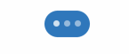

<p align="center">
  
</p>
<h3 align="center">
   React Native Typing Indicator
</h3>
<p align="center">
  A customizable animated typing indicator created using <br/> pure react native <a href="https://facebook.github.io/react-native/docs/animated">Animated</a> library. 
</p>
<p align="center">
  <a title='License' href="https://github.com/watadarkstar/react-native-typing-animation/blob/master/LICENSE" height="18">
    
  </a>
  <a title='Tweet' href="https://twitter.com/intent/tweet?text=Check%20out%20this%20awesome%20React%20Native%20typing%20indicator%20made%20with%20Animated%20library&url=https://github.com/nandiniparimi1107/react-native-typing-indicator" height="18">
    
  </a>
</p>

## Core Features

* Completely Customizable
* No external dependencies
* Fast, lightweight and no images


## Example

```jsx
import React from "react";
import { TypingAnimation } from 'react-native-typing-indicator';

class Example extends React.Component {
  render() {
    return (
      <TypingIndicator />
    );
  }
}
```

## Advanced Example

```jsx
import React from "react";
import { TypingAnimation } from 'react-native-typing-indicator';

class Example extends React.Component {
  render() {
    return (
       <TypingIndicator
          backgroundStyle={styles.typingIndicatorBackground}
          duration={500}
          dotStyle={styles.dotStyle}
        />
    );
  }
}
```

## Props

* **`backgroundStyle`** _(Object)_ -  Background style of the typing indicator (Optional)
* **`dotStyle`** _(Object)_ - Style attribute for each dot in the typing indicator (Optional)
* **`duration`** _(number)_ - Animation duration for each dot (Optional)

## License

* [MIT](LICENSE)

## Author

Feel free to ask me questions on Twitter [@nandinicbit](https://twitter.com/nandinicbit)!


## Contributors
Submit a PR to contribute :)

## Roadmap

* Create a working example with Gifted Chat
* Add an image background that is scalable
